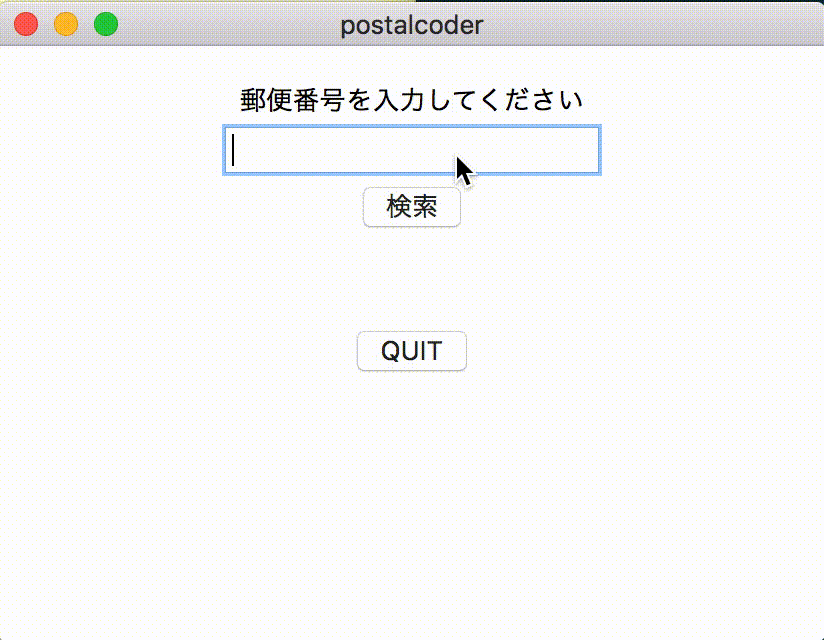

postalcoder
===

Pythonの勉強会用に作成した、沖縄の郵便番号検索ツール。

## Description

Pythonのライブラリ`Tkiner`を使えば、GUIを簡単に作れるという情報から、シンプルなGUIアプリを作成した。郵便番号を入力したら、対応する地名を表示するというもの。データは郵便局のオープンデータを用いた。

[参考ドキュメント](https://docs.python.jp/3/library/tk.html)

## Demo



## Usage
```bash
$ python3 postalcoder.py
```

## Install

```bash
$ python3 setup.py
```
